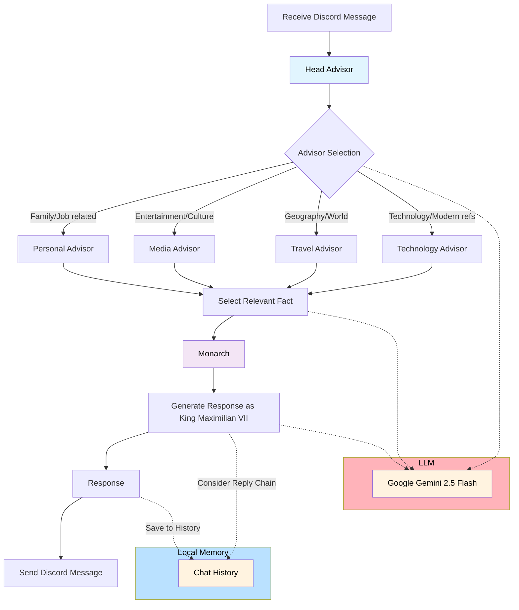

This is King Maximilian VII.

A fictitious 15th century monarch that answers ice breaker questions.

Built to run as a discord bot and respond to "qotd" messages as well as direct mentions.

Uses discord.py for Discord API, sends prompts to Google Gemini 2.5 Flash.

## How It Works

Lost 15th Century Monarch, or Monarch Bot, follows a tool-calling AI Agent pattern.

Using this pattern might seem like overkill, but by separating the personal beliefs of the bot into different categories of "Advisors", the Monarch Bot produces interesting yet consistent responses to new questions.

Since the amount of context passed on any individual LLM call is also much smaller, the prompt has a much lower tendency of "leaking" directly into the output. 

Monarch Bot responds to two different types of questions:

- *Question of the Day*: The first message of the day that starts with "QOTD:" (case and formatting insensitive)
- *Mentions*: A direct mention, including replies, but not @everyone or @here

Monarch Bot is better described as an Agentic system with multiple subagents:

- **Head Advisor** delegates the question to the sub advisor most likely to have relevant knowledge.
    - **Personal Advisor** knows details about the Monarch's family and job.
    - **Media Advisor** knows about the Monarch's opinions on plays, music, and games.
    - **Travel Advisor** knows about the world from the Monarch's 15th century perspective, including exotic countries and animals.
    - **Technology Advisor** knows about technological advancements and interprets any references to modern technologies.

Given simple descriptions of each advisor, the Head Advisor reads the question and indicates which advisor might have relevant information.

Each advisor has a list of "facts" that look something like this:

```
The best form of government is a monarchy, where the King is the absolute ruler.
The most common mistake made by medical professionals is not doing enough bloodletting.
...
```

The chosen Advisor reads the question and indicates which fact from its list may be relevant to the question.

Finally, the main Monarch Bot agent reads the chosen fact, reads the question, and creates a reply.

Question ---> Head Advisor chooses a sub advisor ---> Sub-advisor chooses one fact ---> Monarch considers the chosen fact and answers the question



## How to Use the Repository

You can run this bot yourself by cloning [this repo](https://github.com/nvdutta/15th-Century-Monarch). Using .env.example as a template, create a .env file and supply a [discord bot token](https://discord.com/developers/applications) and [Gemini API key](https://ai.google.dev/gemini-api/docs/api-key).

> Note: The default Gemini free version gave me overload issues when I ran this bot on a single server. A paid account or a free trial for Google Cloud will resolve this issue.

This code can also be used as a framework for AI-integrated discord bots. The fact list and advisor names can be appended or swapped without issue.


